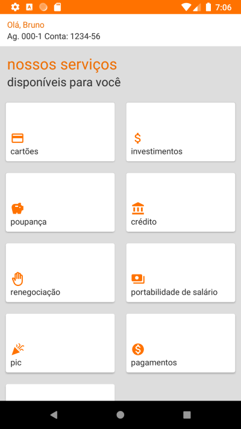

# Clone tela de serviços de App bancário by Chico Rasia

- Emprego de ViewBinding em lugar de 'kotlin-android-extensions';

- Arquitetura MVVM: lista de serviços é mantida no ViewModel;

- Emprego de coroutines;

- Emprega framework Koin para Injeção de dependências, inclusive parâmetros do ViewModel com construtor customizado;

- Uso de Enum para organizar os serviços e seus ícones;

- Cards dos serviços com título e ícone;

- Sintaxe moderna e idiomática;

  

***

everis kotlin bootcamp 2021 :green_heart:
